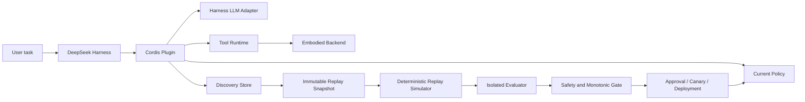
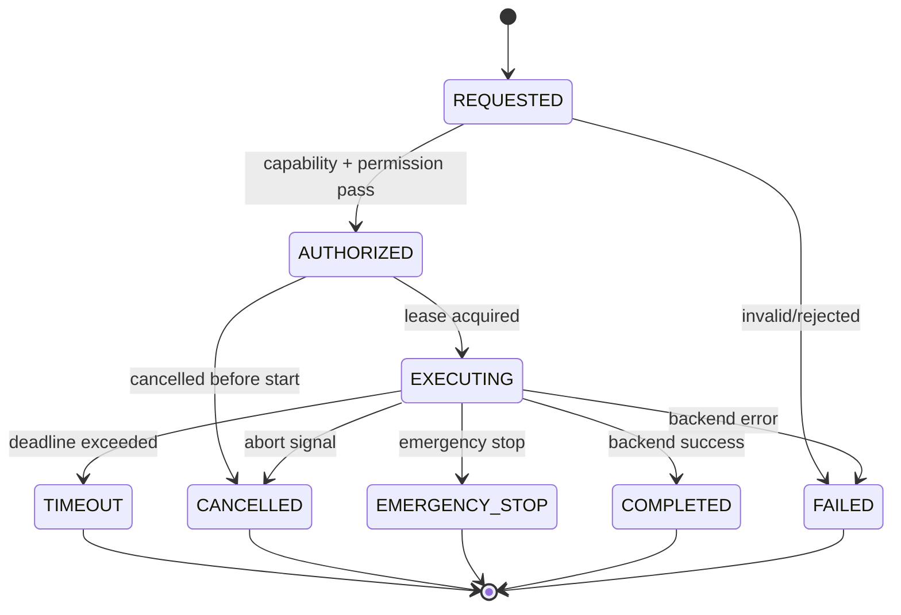

# Dream-RSI DeepSeek Harness Plugin Detailed Design Specification

**版本**：0.1
**日期**：2026-09-18
**狀態**：Implementation-ready design
**Related**：[PROJECT_PLAN.md](PROJECT_PLAN.md)、[FUNCTIONAL_SPEC.md](FUNCTIONAL_SPEC.md)、[BASELINE.md](BASELINE.md)

## 1. Design Intent

本設計把 Dream-RSI 落成一個 Cordis plugin 與一組可獨立測試的 core modules。設計採取兩個邊界：

1. `dream-rsi-core`：不依賴特定 LLM、simulator 或硬體，負責 Discovery、Replay、Evaluation、Evolution contract 與 artifact integrity。
2. `dsh-embodied`：負責 DSH/Cordis adapter、session backend、perceive/act/query-state tools、typed events 與 action safety。

底層 model 是 frozen provider。Evolution Agent 可以修改的只有 policy orchestration 與受審核 tool artifact；不能修改 model weights、evaluation data、deployment registry 或 secrets。

### 1.1 Implementation status notation

- **Implemented**：目前 repository 已有程式與測試。
- **Specified**：本文件定義 contract，但 repository 尚未完成。
- **Deferred**：需要外部 DSH contract、sandbox、simulator 或產品決策後才實作。

## 2. System Context



Online execution and offline evolution are separate failure domains:

- Online task path must continue when evolution fails.
- Offline path must never call the online LLM or external environment during Replay.
- Deployment changes current policy only after artifact and gate checks.

## 3. Runtime Boundaries

### 3.1 Cordis adapter

The adapter owns all Cordis-specific operations:

- `apply(ctx)` entrypoint.
- `ctx.effect()` reversible registration scope.
- tool registration and unregistration.
- service/event/command registration when the pinned DSH contract is confirmed.
- profile and `cordis.patch.yml` compatibility.

Core modules receive plain TypeScript interfaces and must not import Cordis types.

### 3.2 Harness adapter

```ts
export interface HarnessLlm {
  invoke(request: LlmRequest, signal?: AbortSignal): Promise<LlmResponse>;
}

export interface HarnessToolRuntime {
  execute(name: string, args: JsonObject, context: ToolContext): Promise<JsonValue>;
}

export interface HarnessAdapter {
  readonly llm: HarnessLlm;
  readonly tools: HarnessToolRuntime;
  readonly sourceVersion: string;
}
```

All model requests pass through `HarnessLlm.invoke`. The adapter records request/response hashes, token usage, latency, retry count, provider error class and correlation ID. API credentials are resolved by the host secret provider and never passed into candidate code.

### 3.3 Environment adapter

```ts
export interface EnvironmentAdapter {
  observe(request: ObserveRequest): Promise<Observation>;
  availableActions(): Promise<readonly EmbodiedActionType[]>;
  execute(request: ActionRequest, signal?: AbortSignal): Promise<ActionResult>;
  emergencyStop(sessionId: string): Promise<void>;
  reset(sessionId: string): void;
}
```

The adapter is the only component permitted to know a simulator or hardware SDK. Core policy sees action schemas and structured observations, not raw motor channels. Full request/result shapes are in §5.2; `execute` resolves to a terminal result rather than throwing.

## 4. Cordis Plugin Lifecycle

### 4.1 Apply

`apply(ctx)` creates a backend factory and registers embodied tools inside one reversible `ctx.effect` scope. The setup function returns a disposer that unregisters in reverse order. Current implementation covers this tool lifecycle with a mock backend.

Target setup sequence:

1. Validate configuration and capability profile.
2. Resolve storage and artifact directories.
3. Construct service facades.
4. Register typed events.
5. Register tools and read-only commands.
6. Register disposal for workers, stores, backend sessions and tools.

A setup failure must dispose any registrations already created, then fail startup with an actionable error. No asynchronous worker may survive dispose.

### 4.2 Ready and dispose

`ready` verifies storage schema, current policy artifact, evaluator worker availability and backend capability profile. `dispose` cancels evolution jobs, waits for bounded shutdown, closes SQLite/artifact handles, resets session backends and unregisters all effects.

### 4.3 Configuration defaults

```ts
export interface DreamRsiConfig {
  enabled: boolean;
  storage: { sqlitePath: string; artifactDir: string };
  runtime: { maxWorkers: number; taskTimeoutMs: number };
  replay: { maxNodes: number; missRateMax: number; keySchemaVersion: number };
  evaluation: {
    trainRatio: number;
    validationRatio: number;
    holdoutRatio: number;
    minimumHoldoutSamples: number;
    timeoutMs: number;
  };
  operations: { evolutionLock: string; deploymentLock: string; jobLeaseMs: number };
  evolution: { enabled: boolean; maxCandidates: number; autoDeploy: boolean; minimumImprovement: number };
  embodied: { enabled: boolean; requireConfirmation: boolean; actionLeaseMs: number; maxActionsPerMinute: number };
}
```

Defaults: `enabled=true`, `evolution.enabled=false`, `evolution.autoDeploy=false`, `embodied.enabled=false`, evaluator isolation required. Ratio validation requires `train + validation + holdout = 1` and each ratio > 0.

## 5. Online Execution Design

### 5.1 Task and episode

```ts
export interface ResourceBudget {
  maxSteps: number;
  wallClockMs: number;
}

export interface Task {
  taskId: string;
  goal: string;
  environmentId: string;
  policyVersion: string;
  budget: ResourceBudget;
  metadata: JsonObject;
}

export type EpisodeStatus =
  | 'running' | 'completed' | 'failed' | 'cancelled' | 'timeout' | 'emergency_stop';

export interface Episode {
  episodeId: string;
  taskId: string;
  sessionId: string;
  environmentId: string;
  policyVersion: string;
  step: number;
  status: EpisodeStatus;
  correlationId: string;
  startedAt: string;
  endedAt?: string;
}
```

Every task receives a policy version at start. A later deployment cannot mutate the policy used by an already-running episode unless the host explicitly supports a version boundary.

`emergency_stop` is a terminal episode status distinct from `cancelled`: an operator stop forbids automatic retry. `wallClockMs` is enforced between steps and clamps each action deadline; `maxSteps` bounds recorded nodes.

### 5.2 Environment protocol

The contract in `src/embodied/protocol.ts`. Adapters translate a simulator SDK into these types; core policy never sees the SDK.

```ts
export interface Observation {
  sessionId: string;
  environmentId: string;
  environmentVersion: string;
  frameId: string;
  step: number;
  pose: Pose;
  gripper: GripperState;
  objects: ObservedObject[];
  schemaVersion: number;
  timestamp: string;
}

export interface ActionRequest {
  actionId: string;
  sessionId: string;
  taskId: string;
  episodeId: string;
  correlationId: string;
  actionType: EmbodiedActionType;
  parameters: JsonObject;
  timeoutMs: number;
  requestedAt: string;
}

export type ActionStatus = 'completed' | 'failed' | 'timeout' | 'cancelled' | 'emergency_stop';

export interface ActionResult {
  actionId: string;
  status: ActionStatus;
  step: number;
  pose: Pose;
  gripper: GripperState;
  message: string;
  execTimeMs: number;
  completedAt: string;
  error?: string;
}

export interface EnvironmentAdapter {
  observe(request: ObserveRequest): Promise<Observation>;
  availableActions(): Promise<readonly EmbodiedActionType[]>;
  execute(request: ActionRequest, signal?: AbortSignal): Promise<ActionResult>;
  emergencyStop(sessionId: string): Promise<void>;
  reset(sessionId: string): void;
}
```

`execute` resolves to a terminal `ActionResult`; it does not throw for an action-level failure, timeout, cancellation, or stop. The caller records these as outcomes, so a rejected promise means the adapter itself is unusable. A session stopped through `emergencyStop` stays latched until `reset`.

### 5.3 Replay hashes

A `DiscoveryNode` carries two hashes, both computed from the pre-action observation:

| Hash | Covers | Excludes |
|---|---|---|
| `stateHash` | `pose`, `gripper` | `step`, `timestamp`, `objects` |
| `observationHash` | `environmentId`, `environmentVersion`, `frameId`, `schemaVersion`, `pose`, `gripper`, `objects` | `step`, `timestamp` |

Both exclusions are load-bearing: `step` and `timestamp` differ on every run, so covering either would make every replay lookup a miss. `stateHash` is the Markov state, so a policy reaching an equivalent state at a later step still resolves to the recorded outcome.

### 5.4 Episode pipeline

`src/tasks/runner.ts` records exactly one Discovery node per step — including failed, timed-out, and cancelled attempts, because a negative result is evidence and dropping it would make the recorded tree disagree with what the environment did.

`src/tasks/pipeline.ts` then runs `runEpisode -> createEvaluationSnapshot -> replay -> evaluateReplay` and applies the runtime's derived ceilings (`replay.maxNodes`, `replay.missRateMax`, `evaluation.timeoutMs`, `evaluation.minimumHoldoutSamples`).

Replaying an episode's own recorded decisions is a **determinism check, not generalization evidence**: every replayed decision was recorded from the state it is replayed against, so a clean run only proves the replay key is stable and the state index resolves. Generalization requires holdout tasks the policy never saw — the multi-task benchmark, which is still an open release blocker.

### 5.5 Embodied tools

#### `embodied_perceive`

Input: `session_id`, optional `sensor_types`, `include_objects`, `include_pose`, `artifact_threshold_bytes`.

Output: compact text/JSON observation, object references, pose, timestamp, coordinate-frame ID, schema version and artifact references. Large RGB/depth/point-cloud payloads are stored externally with checksum and retention metadata.

#### `embodied_act`

Input: `session_id`, `action_type`, `parameters`, optional `timeout_ms`, `confirmation_token`.

Processing:

1. Observe, to learn the coordinate frame the action will be expressed in.
2. Hand the action to `ActionGuard`, which validates the capability profile, confirmation, session mutex, idempotency key and rate limit, then holds the action lease (§5.6).
3. Emit `embodied/action-started`.
4. Execute through `EnvironmentAdapter` with the guard's deadline and abort signal.
5. Emit completed, failed, cancelled, timeout or emergency-stop event.

A rejected action never reaches the adapter and returns `success: false` with a `rejection_code`.

Output contains `success`, `action_id`, the state-machine `state`, the terminal `status`, and either `result` or `error`. `state` and `status` are distinct: `state` is where the action ended in the state machine, `status` is the backend outcome.

#### `embodied_query_state`

Input is a bounded query enum or approved DSL. The tool may return room graph, objects, navigation nodes and last state reference. It must reject arbitrary code, unbounded graph traversal and unauthorized session access.

### 5.6 Action state machine



After `EMERGENCY_STOP`, automatic retry is forbidden. All terminal transitions are idempotent and carry the same `actionId`.

Implemented in `src/safety/action-state.ts` as an explicit transition table; a transition absent from the table throws rather than silently succeeding.

#### Capability profile

`src/safety/capability.ts`. Every embodied backend declares one, and a capability absent from it is denied rather than defaulted. `checkCapability` rejects, in order: an undeclared action, an undeclared coordinate frame, a parameter the action does not accept, a numeric parameter beyond `maxNumericMagnitude`, and a deadline beyond `maxDurationMs`.

```ts
export interface CapabilityProfile {
  profileId: string;
  sensors: string[];
  coordinateFrames: string[];
  actions: Partial<Record<EmbodiedActionType, ActionCapability>>;
}

export interface ActionCapability {
  actionType: EmbodiedActionType;
  risk: 'safe' | 'guarded' | 'high';
  requiresConfirmation: boolean;
  limits: { allowedParameters: string[]; maxNumericMagnitude: number; maxDurationMs: number };
}
```

#### Action guard

`src/safety/action-guard.ts` owns one session's safety state and is the only path to a backend when `RunEpisodeOptions.guard` is set. `execute` runs, in order:

1. **Stop latch.** Checked *before* the idempotency lookup: after an operator stop, a previously recorded result must not be replayed as a successful retry.
2. **Idempotency.** A key that was already authorized resolves to its recorded outcome without reaching the backend.
3. **Session mutex.** A second action on a busy session is refused, not queued.
4. **Capability profile.** Any rejection ends the action at `REQUESTED -> FAILED`.
5. **Confirmation.** Required when both the capability and `embodied.requireConfirmation` say so. With no host approval hook the action is denied, so approval is opt-in and never implied.
6. **Rate limit.** A sliding `RATE_WINDOW_MS` window per session.
7. **Dispatch** on `AUTHORIZED -> EXECUTING`, holding a lease for `embodied.actionLeaseMs`.

Rejections are returned rather than thrown, and are **not** cached under the idempotency key: a rate-limited or busy rejection is re-evaluated on the next attempt, while an authorized action never runs twice.

The guard owns the two session-level deadlines, so they override whatever the aborted backend call reports: a stop in flight settles as `EMERGENCY_STOP` and a held lease settles as `TIMEOUT`, regardless of the adapter returning `cancelled`.

`emergencyStop` latches the session and aborts any action in flight. The latch outlives the episode: `runEpisode` latches the guard when an episode ends in `emergency_stop`, so a later episode reusing the session is refused. `releaseSession` clears it, and re-arming a stopped session is an explicit operator act.

## 6. Discovery Data Model

### 6.1 Discovery node

```ts
export interface DiscoveryNode {
  nodeId: string;
  taskId: string;
  parentId: string | null;
  policyVersion: string;
  environmentVersion: string;
  stateHash: string;
  observationHash: string;
  actionType: string;
  actionParams: JsonObject;
  result: JsonValue;
  score: number;
  tokenCost: number;
  execTimeMs: number;
  criticalPathMs?: number;
  sessionId?: string;
  episodeId?: string;
  episodeStep?: number;
  correlationId?: string;
  idempotencyKey: string;
  schemaVersion: number;
  createdAt: string;
}
```

The repository must enforce unique `idempotencyKey`, preserve the first accepted node for retries, and provide indexes for `taskId`, `parentId`, `policyVersion`, `environmentVersion` and `createdAt`.

### 6.2 Artifact reference

```ts
export interface ArtifactMetadata {
  /** Lowercase SHA-256 of the stored bytes, and the name the blob is filed under. */
  artifactId: string;
  kind: 'observation' | 'llm-response' | 'sandbox-output' | 'policy' | 'tool' | 'evaluation-report';
  mediaType: string;
  schemaVersion: number;
  byteLength: number;
  createdAt: string;
  retentionUntil: string | null;
  deletedAt: string | null;
}
```

Database rows contain references, not large binary payloads.

Because storage is content-addressed, `artifactId` **is** the SHA-256 of the bytes: a separate `contentSha256` field would be the same value twice, and a stored `uri` is derivable from the id. `verify(artifactId)` re-hashes the blob on disk rather than trusting the index, and distinguishes `unknown`, `deleted`, `missing_blob`, and `checksum_mismatch`. `assertArtifactsVerified` fails closed before evaluation; deployment must call it rather than re-implement the check.

Retention and deletion are recorded in metadata, never by rewriting or truncating a blob. `pruneExpired` deletes artifacts past `retentionUntil` and only ever runs when called: a retention policy that fires on its own is an audit-trail hazard.

## 7. Replay Design

### 7.1 Canonical ReplayKey

Replay lookup key is the canonical JSON encoding of:

```ts
export interface ReplayKeyInput {
  environmentVersion: string;
  stateHash: string;
  actionType: string;
  normalizedActionParams: JsonValue;
  observationHash: string;
}
```

Object keys are sorted recursively; arrays preserve order; numbers and strings use one canonical JSON representation. The key schema version is included in snapshot metadata. `nodeId` is never sufficient for a replay hit.

### 7.2 Snapshot

`createEvaluationSnapshot(nodes, splitConfig, createdAt)`:

1. Clone input nodes.
2. Freeze nested structures.
3. Assign task-level train/validation/holdout membership using deterministic SHA-256.
4. Serialize schema version, creation time and splits.
5. Hash the serialized content as `snapshotId`.
6. Return an immutable snapshot.

Evaluation stores the snapshot ID and content hash. A snapshot is never edited in place.

The node list comes from `DiscoveryStore.readAll()`, which a database-backed store serves under a single deferred transaction. Reading the tree with more than one statement under read-committed isolation can straddle a concurrent write and yield a tree that never existed.

### 7.3 Simulator contract

```ts
export interface ReplaySimulator {
  reset(caseId: string): void;
  step(action: ReplayAction): ReplayTransition;
  counterfactual(stateHash: string, actions: readonly ReplayAction[]): readonly ReplayTransition[];
}

export type ReplayTransition =
  | { kind: 'HIT'; node: DiscoveryNode; nextStateHash: string }
  | { kind: 'BOUNDARY_MISS'; stateHash: string; alternatives: readonly ReplayAction[]; reason: string };
```

Replay may read snapshot and artifact store only. The implementation must not import the Harness LLM client, execute tools, start a sandbox, access network, or mutate the source store. A replay purity test should run with those capabilities denied.

## 8. Evaluation Design

### 8.1 Metrics

For visited nodes:

```text
Q_raw = max(score(node)) or 0
C_raw = sum(tokenCost(node) + gamma * execTimeMs(node))
P_raw = totalExecTime / max(criticalPathMs, 1)
M = boundaryMissCount / max(totalAttempts, 1)

Q = Q_raw / max(qualityReference, 1)
C = C_raw / max(costBudget, 1)
P = P_raw / max(idealParallelEfficiency, 1)
S = wq*Q - wc*C + wp*P - boundaryPenalty*M
```

Store Q, C, P, M and S separately. A single score cannot hide a quality or safety regression.

### 8.2 Evaluation request and report

```ts
export interface EvaluationRequest {
  snapshotId: string;
  policyArtifactId: string;
  split: 'train' | 'validation' | 'holdout';
  seed: string;
  configHash: string;
}

export interface EvaluationReport {
  evaluationId: string;
  evaluatorVersion: string;
  sourceHash: string;
  snapshotId: string;
  policyArtifactId: string;
  split: EvaluationRequest['split'];
  metrics: { quality: number; cost: number; parallelEfficiency: number; missRate: number; score: number };
  caseResults: readonly CaseResult[];
  sampleCount: number;
  passed: boolean;
  guardResults: readonly GuardResult[];
  createdAt: string;
  signature?: string;
}
```

Reports are generated outside candidate code. The current repository has a child-process evaluator with timeout; before untrusted candidate code is accepted, add OS/container controls for memory, CPU, filesystem, network and output size.

### 8.3 Isolation protocol

Parent process sends one JSON request to a worker over stdin. Worker returns one JSON response over stdout and exits. Parent enforces timeout, captures abnormal exit, and never trusts worker output without schema validation. The production worker must additionally:

- use read-only snapshot/holdout mounts;
- deny secrets and network by default;
- limit CPU, memory, process count, output bytes and wall time;
- kill the complete process group on timeout;
- write only a temporary result that parent validates and atomically promotes.

## 9. Evolution and Candidate Design

### 9.1 Policy artifact

```ts
export interface PolicyArtifact {
  artifactId: string;
  version: string;
  parentVersion: string;
  sourceSha256: string;
  sourceRef: ArtifactRef;
  manifest: { entrypoint: string; dependencies: readonly string[]; schemaVersion: number };
  allowedCapabilities: readonly string[];
  createdBy: 'human' | 'evolution-agent';
  createdAt: string;
}
```

Candidates are immutable artifacts. The Evolution Agent may output source, diff, manifest and build identifier, but cannot write `current` directly.

### 9.2 Candidate generation

Evolution Agent input: policy source, type contracts, selected train/validation results and replay snapshot metadata. It does not receive holdout records, deployment secrets or evaluator internals.

Allowed mutation classes:

- frontier/priority queue ordering;
- branch scheduling and bounded parallelism;
- early stopping and pruning thresholds;
- resource budget allocation;
- retry and exploration coefficients.

Natural-language summaries may be retained for diagnostics but cannot become automatic hard pruning rules without explicit policy review.

### 9.3 Guard pipeline

```text
candidate source
  -> parse/type check
  -> AST forbidden-node/import check
  -> dependency allowlist
  -> resource/network capability check
  -> isolated build/test
  -> train replay
  -> validation replay
  -> holdout replay
  -> monotonic gate
  -> human approval or explicit auto-deploy policy
  -> canary
  -> deployment
```

Any failure rejects the candidate and leaves current policy unchanged.

## 10. Monotonic Gate

Candidate and current policy must evaluate the identical case ID set. Required checks:

- configured minimum pass ratio, default 95%, where candidate score is not below current score;
- candidate score >= current score + `minimumImprovement`;
- boundary miss rate <= configured maximum;
- quality, cost and parallel budgets pass independently;
- holdout minimum sample count and confidence requirement pass;
- no AST, dependency, resource or signature failure.

The gate result is immutable and records every rejection reason, case-level difference and configuration hash.

## 11. Deployment, Canary and Rollback

### 11.1 Deployment state

```text
PROPOSED -> APPROVED -> CANARY -> ACTIVE
PROPOSED -> REJECTED
APPROVED -> ROLLED_BACK
CANARY -> ROLLED_BACK
ACTIVE -> DEGRADED -> ROLLED_BACK
```

Only the deployment writer can transition state. The state record includes policy artifact, evaluation report, operator/approval, lock owner, timestamps and rollback target.

### 11.2 Atomic deployment

1. Acquire deployment `SingleWriterLock` lease.
2. Verify artifact checksum, signature and parent version.
3. Confirm current version still matches the gate baseline.
4. Write deployment intent/audit record.
5. Start canary using immutable artifact.
6. Check quality, error rate, latency and cost thresholds.
7. Atomically update current pointer.
8. Emit `dream-rsi/policy-deployed`.
9. Release lock and retain previous stable versions.

A failure before step 7 leaves current pointer untouched. A failure after step 7 triggers health monitoring and rollback to the previous verified stable artifact.

### 11.3 Writer lease

`SingleWriterLock` uses atomic directory creation, lease metadata, expiry recovery and heartbeat. A crashed owner is recoverable after lease expiry. Recovery must be audited, and production should additionally use a monotonic clock/transactional storage where available to avoid wall-clock anomalies.

## 12. Security Model

Threat actors include a generated candidate, malicious tool output, prompt injection, compromised backend and accidental operator misuse.

Controls:

- Frozen model and explicit Harness adapter.
- Candidate source checksum, dependency allowlist and AST guard.
- Process/container isolation with no secrets and restricted network/filesystem.
- Read-only snapshot and holdout mounts.
- Capability profile and high-level embodied actions only.
- Per-session authorization, confirmation, mutex, lease, rate limit and emergency stop.
- Input/output size limits and redacted logs.
- Immutable audit trail for approval, deployment and rollback.
- Retention and deletion policy for observation artifacts.

AST checking is a prefilter, never the security boundary. Any candidate capable of executing code must run in an OS-level restricted environment.

#### Candidate gate

Two independent checks run over the same source before a candidate is evaluated or executed, composed by `scanCandidate` and enforced by `assertCandidateAccepted`:

| Guard | Rejects |
|---|---|
| `runAstGuard` | `eval`, `Function`, `exec*`/`spawn*`, dynamic `import()`, non-literal `require()`, forbidden module specifiers, `process.env`/`binding`/`kill`/`mainModule` |
| `checkImports` | a relative import resolving outside the candidate root; a package absent from the allowlist; a built-in absent from the allowlist; any built-in that grants a capability |

Built-ins are classified by the capability they grant — filesystem, network, process, secrets, code-generation, concurrency. **A capability-granting built-in cannot be allowlisted at all**, because approving it by name would make the profile meaningless. The unlisted remainder falls to the package allowlist and is denied, so a new Node release cannot silently widen what a candidate may reach.

Both guards are pure functions of the source string: no state, no mutation, and the same input always yields the same verdict.

#### Evaluator isolation

The evaluator runs in a child process that leads its own process group (`detached: true`). A deadline, a cancellation, or an output overflow kills the whole group, because killing only the direct child leaves grandchildren running with the host's privileges.

| Control | Behaviour |
|---|---|
| Deadline | `timeoutMs`, default 5000 |
| Cancellation | `signal`; kills the group |
| Output bound | `maxOutputBytes` on stdout and on stderr, default 1 MiB |
| Environment | `PATH` only. Inheriting `process.env` would hand the child every API key the parent holds |
| Result validation | Fields are rebuilt from untrusted JSON rather than cast, so a crafted response cannot inject extra properties |

CPU, memory, filesystem, and network limits require OS-level confinement and are not yet implemented.

## 13. Observability and Audit

Every event and metric carries:

- `taskId`
- `episodeId` when applicable
- `policyVersion`
- `evaluationId` when applicable
- `correlationId`
- timestamp and schema version

Required metrics:

- task success, quality, retry, timeout and cancellation rates;
- DeepSeek token/cost/latency and tool/backend latency;
- replay hit ratio and boundary miss rate;
- Q/C/P/M/S per policy and task family;
- candidate rejection reasons, approval latency, canary results and rollback count;
- action failure, emergency-stop and capability-denial rates;
- lock acquisition, expiry recovery and job duration.

Logs must redact API keys, secrets, full prompts where not needed, and unnecessary personal data.

## 14. Repository and Module Layout

Target layout, retaining current modules where possible:

```text
src/
  index.ts
  config.ts
  adapter/
    cordis.ts
    harness.ts
    environment.ts
  embodied/
    backend.ts
    capability-profile.ts
    action-state-machine.ts
    perceive.ts
    act.ts
    query-state.ts
    events.ts
  discovery/
    models.ts
    sqlite-store.ts
    artifact-store.ts
  replay/
    key.ts
    snapshot.ts
    simulator.ts
  evolution/
    evaluator.ts
    evaluator-worker.ts
    isolated-evaluator.ts
    split.ts
    monotonic-gate.ts
    candidate-generator.ts
  guardrails/
    ast-guard.ts
    resource-guard.ts
  deployment/
    policy-registry.ts
    canary.ts
    rollback.ts
  operations/
    single-writer-lock.ts
    job-runner.ts
```

Core dependencies flow inward:

```text
Cordis/DSH adapter -> runtime/embodied/deployment adapters
                     -> core interfaces
                     -> storage/replay/evaluator primitives
```

Core modules must not import simulator SDKs, Cordis context, or network clients.

## 15. API and Error Conventions

Errors are structured and safe to expose:

```ts
export interface DshRsiError {
  code:
    | 'CONFIG_INVALID'
    | 'CAPABILITY_DENIED'
    | 'ACTION_TIMEOUT'
    | 'ACTION_CANCELLED'
    | 'EMERGENCY_STOP'
    | 'REPLAY_BOUNDARY_MISS'
    | 'EVALUATION_TIMEOUT'
    | 'EVALUATION_INVALID'
    | 'GUARD_REJECTED'
    | 'GATE_REJECTED'
    | 'LOCK_UNAVAILABLE'
    | 'ARTIFACT_INTEGRITY_FAILURE';
  message: string;
  retryable: boolean;
  correlationId: string;
  details?: JsonObject;
}
```

Never include secrets, arbitrary source dumps or unbounded backend output in an error response.

## 16. Testing Strategy

### Unit tests

- canonical JSON and ReplayKey normalization;
- repository idempotency and indexes;
- split determinism and no task leakage;
- evaluator numerical formulas and invalid input handling;
- snapshot immutability and hash stability;
- lock ownership, heartbeat, expiry recovery and release;
- action state machine terminal transitions;
- capability profile allow/deny.

### Integration tests

- Cordis apply/dispose and partial setup failure;
- three embodied tools with per-session isolation;
- online task to Discovery DAG;
- snapshot to replay to evaluation;
- evaluator worker timeout and abnormal exit;
- candidate guard to gate to report;
- deployment canary and rollback.

### Security and failure tests

- forbidden AST/import/network/filesystem access;
- holdout read/write attempts;
- prompt injection in observation/tool output;
- worker crash, process-group kill and stale lease;
- corrupted artifact/checksum mismatch;
- provider outage and exhausted retry budget;
- emergency stop followed by retry attempt.

Acceptance target: deterministic tests must differ by less than `1e-6` for repeated identical inputs; security failures must leave current policy and deployment registry unchanged.

## 17. Open Decisions

1. Exact DSH profile manifest and `cordis.patch.yml` schema for the deployment target.
2. DeepSeek Harness LLM facade and session identity contract.
3. First simulator/task family and observation coordinate system.
4. Signature provider and key rotation policy.
5. Production sandbox technology: container, worker VM or platform sandbox.
6. Artifact retention, encryption and personal-data deletion requirements.
7. Whether production auto-deploy is ever allowed without human approval.

Until these decisions are resolved, defaults remain: simulator backend, evaluate-only, auto-deploy disabled, high-risk confirmation required, no secrets in evaluator, and process/container isolation required for generated code.
