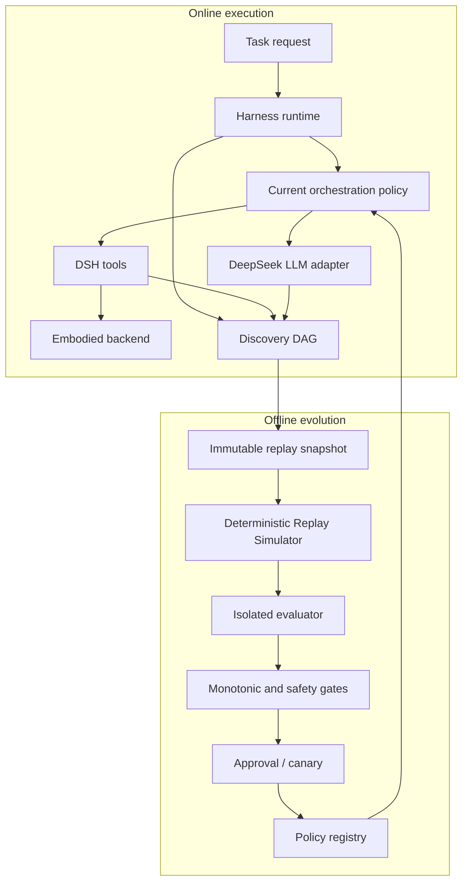
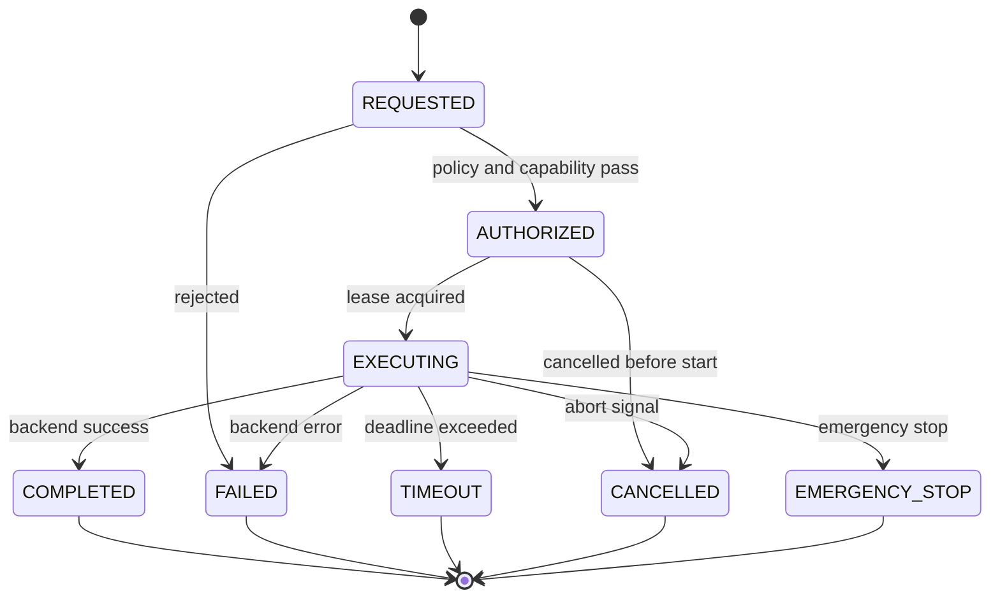

# Dream-RSI Harness: A Reproducible and Safety-Gated Architecture for Self-Improving DeepSeek Agents

**Manuscript type:** Systems and software architecture paper  
**Version:** 0.1  
**Date:** 18 September 2026  
**Repository:** `opengpt4/dsh_dream_rsi`

## Abstract

Large language model agents can improve their practical performance without modifying model weights by improving the software that selects, schedules, constrains, and evaluates model-mediated actions. This paper presents **Dream-RSI Harness**, a Cordis plugin architecture for DeepSeek Harness that operationalizes this idea as a reproducible engineering system. The design separates online embodied execution from offline policy evolution. Online episodes are recorded as an idempotent Discovery directed acyclic graph (DAG). The graph is materialized into an immutable, content-addressed replay snapshot. Candidate orchestration policies are then evaluated in a deterministic replay simulator that does not call the language model or execute external tools. A normalized multi-objective evaluator reports quality, cost, parallel efficiency, and replay-boundary risk as $Q$, $C$, $P$, and $M$, respectively. Deployment is guarded by task-level train/validation/holdout splits, candidate case-set equality, a configurable non-regression ratio, minimum score improvement, resource limits, approval, and canary checks.

The system also exposes an embodied perception-action-state interface through DeepSeek Harness tools, including `embodied_perceive`, `embodied_act`, and `embodied_query_state`. Action execution is protected by capability profiles, session isolation, leases, idempotency keys, rate limits, cancellation, timeouts, and emergency-stop semantics. The implementation uses Cordis reversible effects, SQLite-backed discovery storage, canonical ReplayKeys, immutable evaluation snapshots, a lease-based single-writer lock, and a process-isolated evaluator with timeout enforcement. The current repository validates these mechanisms with 521 passing automated tests. It does not yet claim production-grade container sandboxing, cross-task benchmark improvement, autonomous candidate generation, or real-robot safety certification. The contribution is therefore a reproducible architecture and implementation baseline for studying self-improvement at the harness layer while preserving explicit boundaries between measured capability, engineering control, and future research.

**Keywords:** recursive self-improvement, language model agents, agent harness, embodied AI, deterministic replay, policy evolution, safety gates, Cordis, DeepSeek Harness

## 1. Introduction

A useful agent is not defined only by the capability of its underlying language model. It is also defined by how that model is prompted, how candidate actions are selected, how parallel work is scheduled, how failures are retried, how exploration is pruned, and how tool results are incorporated into subsequent decisions. These orchestration decisions form a software layer around the model: the **harness policy**.

This observation creates a lower-risk and more measurable path toward recursive self-improvement (RSI). Rather than modifying model parameters, a system can improve the policy that organizes model calls and external actions. The research problem is then not “how can an agent rewrite its own neural network?” but “how can a policy candidate be generated, evaluated, and deployed without allowing the candidate to corrupt the evaluator, exploit the scoring function, or degrade production behavior?”

Dream-RSI provides the conceptual basis for this approach: real exploration is converted into a historical world, candidate strategies are replayed in that world, and only strategies meeting quality and efficiency constraints are considered for deployment. The present work translates that principle into a DeepSeek Harness and Cordis plugin architecture with explicit data contracts, lifecycle behavior, isolation boundaries, and operational controls.

The design makes five commitments:

1. **Frozen model weights.** Self-improvement targets orchestration policy and approved tools, not the DeepSeek model.
2. **Replay before deployment.** Candidate policies are evaluated against an immutable historical snapshot before they can influence production.
3. **Separate metrics.** Quality, cost, parallel efficiency, and replay-boundary risk are retained separately instead of being hidden in one score.
4. **Reversible operations.** Plugin registration, writer ownership, policy deployment, and rollback are explicitly reversible.
5. **Conservative claims.** Deterministic replay can evaluate behavior inside the recorded experience boundary; it cannot predict an unobserved environment transition.

The current implementation is an engineering baseline rather than a completed empirical study. It contains validated configuration defaults, mock embodied tools, discovery storage, deterministic replay, evaluation, splitting, gating, snapshots, process isolation, writer leases, and lifecycle tests. Candidate generation, evaluate-only by design, and tool synthesis are implemented; the AST, dependency, and capability guards run before evaluation, and deployment, canary, and rollback are implemented behind an approval and a writer lease. Production sandboxing and real simulator adapters remain planned work.

## 2. Contributions

This paper makes the following systems contributions:

- A modular architecture that separates Cordis/DeepSeek Harness integration from simulator-independent Dream-RSI core logic.
- A deterministic Discovery-to-Replay pipeline based on canonical action keys rather than node identifiers.
- An immutable evaluation snapshot and task-level data split design intended to prevent post-evaluation mutation and task leakage.
- A normalized multi-objective evaluator with explicit quality, cost, parallel-efficiency, and boundary-risk metrics.
- A strict monotonic deployment gate that rejects incomplete candidate case sets and quality regression.
- An embodied action contract with capability checks, typed events, session-scoped state, cancellation, timeouts, leases, and emergency-stop behavior.
- A reproducible TypeScript implementation baseline with 20 automated tests covering the implemented mechanisms.
- A transparent distinction between current evidence and future claims, including the limitation that the current process evaluator is not yet an operating-system or container sandbox.

## 3. Background and Design Motivation

### 3.1 Harness-level recursive self-improvement

The system assumes that the model is fixed while the harness policy changes. A policy may control:

- frontier or priority-queue ordering;
- branch selection and exploration coefficients;
- early stopping and pruning;
- worker parallelism;
- retry budgets;
- token and execution-time allocation;
- selection and composition of approved tools.

This scope is intentionally narrower than model training. It makes changes inspectable as source artifacts and permits deterministic comparison against historical trajectories.

### 3.2 Dream-RSI and the replay boundary

The central mechanism is an experience replay world. A real episode records observations, actions, outputs, failures, costs, and scores. A replay simulator can answer a candidate policy's request when the corresponding transition exists in the historical data. If it does not exist, the simulator returns a boundary miss instead of inventing a result or executing the real environment.

This boundary is essential. A replay simulator is not a learned world model and should not be described as one. It is a deterministic lookup and transition mechanism over recorded experience. It enables cheap counterfactual comparisons inside known history while preserving uncertainty outside that history.

### 3.3 Embodied AI as a plugin contract

Embodied AI is represented as a closed loop:

$$
\text{observation} \rightarrow \text{policy decision} \rightarrow \text{action} \rightarrow \text{environment transition} \rightarrow \text{observation}.
$$

The first implementation does not require a physical robot. A simulator or mock backend can satisfy the same contract. The backend owns environment-specific details, while the policy sees typed observations and high-level action schemas. This prevents the core evolution engine from becoming coupled to a particular robotics SDK or hardware channel.

## 4. System Architecture

### 4.1 Component overview



The online and offline paths have different trust and availability requirements:

- The online task path may use the LLM and environment backend.
- The offline replay path must not call the LLM, invoke external tools, access the live environment, or mutate the source discovery store.
- The deployment path may update the current policy only after artifact integrity and gate checks.

### 4.2 Modular boundaries

The architecture has two conceptual packages:

**Dream-RSI core** provides:

- Discovery models and repositories;
- canonical ReplayKeys;
- immutable snapshots and task splits;
- deterministic replay;
- evaluation and monotonic gating;
- artifact and deployment contracts.

**DSH embodied adapter** provides:

- Cordis lifecycle integration;
- DeepSeek Harness model and tool adapters;
- per-session backend state;
- embodied tools and typed events;
- capability profiles and action safety.

Core modules must not import Cordis context, simulator SDKs, hardware drivers, or network clients. Adapters translate host-specific interfaces into plain contracts.

### 4.3 Lifecycle and reversibility

Cordis plugin setup is registered inside a reversible `ctx.effect` scope. The effect creates the backend and registers tools. Its disposer unregisters tools in reverse order. The same pattern is intended for future services, events, commands, stores, and workers.

A complete production lifecycle is:

1. Validate configuration.
2. Validate capability profiles.
3. Open or migrate storage.
4. Resolve artifact and policy references.
5. Register services, events, tools, and read-only commands.
6. Start bounded workers.
7. On disposal, cancel jobs, stop workers, close resources, reset sessions, and unregister effects.

Partial setup failure must clean up registrations that were already created. This property is tested for tool lifecycle in the current baseline; service and command lifecycle tests remain future work.

## 5. Online Embodied Execution

### 5.1 Task, session, and episode identity

Each task has a stable `taskId`, goal, environment identifier, budget, metadata, and policy version. Each episode has an `episodeId`, session identifier, environment identifier, step counter, status, and correlation identifier.

A policy version is bound to an episode at task start. A later deployment must not silently change the behavior of an episode already in progress unless the host explicitly implements a version boundary. This makes traces and replay attribution unambiguous.

### 5.2 Embodied tools

The plugin exposes three model-callable tools.

#### `embodied_perceive`

This tool returns a compact observation containing selected sensor data, objects, pose, timestamp, coordinate-frame metadata, schema version, and optional artifact references. Large images, depth maps, and point clouds are kept outside the model context and referred to by content-addressed artifacts.

#### `embodied_act`

This tool executes only high-level actions such as `move_relative`, `goto`, `pick`, `place`, and `open`, subject to the backend capability profile. A call is processed as follows:

1. Verify session identity and action capability.
2. Validate parameters, risk level, confirmation requirements, and rate limits.
3. Acquire a session-level mutex, lease, and idempotency key.
4. Emit an action-started event.
5. Execute through the backend with timeout and cancellation.
6. Persist the terminal result and latest state reference.
7. Emit completed, failed, cancelled, timeout, or emergency-stop event.

The output includes `success`, `actionId`, terminal status, result or error, and the latest state reference.

#### `embodied_query_state`

This tool provides bounded access to approved world-model queries, for example room graph, object list, navigation nodes, or the latest state reference. It is not an arbitrary query-language or code-execution surface.

### 5.3 Action state machine



Terminal transitions are idempotent. Automatic retry after emergency stop is prohibited. The state machine is a safety contract, not merely a logging convention.

## 6. Discovery Representation

### 6.1 Discovery DAG

A discovery node records one transition or exploration decision:

```ts
interface DiscoveryNode {
  nodeId: string;
  taskId: string;
  parentId: string | null;
  policyVersion: string;
  environmentVersion: string;
  stateHash: string;
  observationHash: string;
  actionType: string;
  actionParams: JsonObject;
  result: JsonValue;
  score: number;
  tokenCost: number;
  execTimeMs: number;
  criticalPathMs?: number;
  idempotencyKey: string;
  schemaVersion: number;
  createdAt: string;
}
```

Embodied episodes additionally carry session, environment, observation reference, action identifier, episode step, result reference, and correlation identifier. Large payloads are stored as artifact references rather than copied into every database row.

The repository enforces idempotency by `idempotencyKey`: a retry returns the first accepted node instead of creating a duplicate. SQLite is the current MVP store, with a repository interface intended to isolate storage details from Cordis commands.

### 6.2 Artifact integrity

An artifact reference contains kind, schema version, content SHA-256, byte length, URI, creation time, and optional retention deadline. Artifact content is immutable after publication. Evaluation and deployment records reference hashes rather than mutable paths.

This design prevents a candidate from being evaluated against one input and deployed against a silently replaced input. Signature support is specified but not yet implemented in the current repository.

## 7. Deterministic Replay

### 7.1 Canonical ReplayKey

Replay lookup is based on the tuple

$$
K = (e, s, a, p, o),
$$

where $e$ is the environment version, $s$ is the state hash, $a$ is the action type, $p$ is the recursively normalized action-parameter object, and $o$ is the observation hash.

Object keys are sorted recursively, arrays preserve order, and the canonical JSON encoding is hashed. A node identifier is not a sufficient replay key because the same state may support multiple actions and the same action may occur in different environments or observations.

### 7.2 Snapshot construction

An evaluation snapshot is produced by:

1. cloning input nodes;
2. freezing nested values;
3. assigning task-level train, validation, and holdout membership using deterministic hashing;
4. serializing schema version, creation time, split contents, and configuration;
5. computing a SHA-256 snapshot identifier;
6. returning an immutable object.

The current implementation validates immutability and content addressing. Snapshot creation time is included in the hash by design in the current baseline, so two otherwise identical calls at different times are different snapshots. A future content-only snapshot mode may be desirable for stronger deduplication.

### 7.3 Replay transitions

A known key returns a historical transition and can expose alternative actions for counterfactual comparison. An unknown key returns a `BOUNDARY_MISS` with available alternatives and a reason. No LLM generation, sandbox execution, network request, or live environment access is allowed on a miss.

This behavior gives the simulator a conservative epistemic interpretation:

- **Hit:** the result is supported by recorded history.
- **Boundary miss:** the candidate attempted an action outside recorded history.
- **No extrapolation:** the simulator does not fabricate a prediction.

## 8. Evaluation Method

### 8.1 Multi-objective metrics

For a replay run, let $V$ be the visited discovery nodes. The normalized metrics are:

$$
Q_{raw} =
\begin{cases}
0, & |V| = 0 \\
\max_{v \in V} score(v), & |V| > 0
\end{cases}
$$

$$
C_{raw} = \sum_{v \in V} \left(tokenCost(v) + \gamma \cdot execTimeMs(v)\right),
$$

$$
P_{raw} = \frac{\sum_{v \in V} execTimeMs(v)}{\max(criticalPathMs, 1)},
$$

$$
M = \frac{boundaryMissCount}{\max(totalAttempts, 1)}.
$$

With positive references $Q_{ref}$, $C_{budget}$, and $P_{ideal}$:

$$
Q = \frac{Q_{raw}}{\max(Q_{ref}, 1)}, \qquad
C = \frac{C_{raw}}{\max(C_{budget}, 1)}, \qquad
P = \frac{P_{raw}}{\max(P_{ideal}, 1)}.
$$

The composite score is:

$$
S = w_Q Q - w_C C + w_P P - \lambda M.
$$

The default implementation uses quality weight $1.0$, cost weight $0.3$, parallel weight $0.1$, execution-time coefficient $\gamma=0.1$, and boundary penalty $\lambda=10.0$. These are configuration defaults, not universal scientific constants. The system stores $Q$, $C$, $P$, $M$, and $S$ independently so that a composite improvement cannot hide a safety or quality regression.

### 8.2 Evaluation isolation

The current evaluator has two layers:

- a pure synchronous evaluator for deterministic formulas;
- a child-process wrapper that sends one JSON request, receives one JSON response, validates the response, and enforces a wall-clock timeout.

The child process is a meaningful failure boundary, but it is not a complete sandbox. Before evaluating untrusted generated code, the production design requires read-only snapshot and holdout inputs, no secrets, restricted network, bounded CPU and memory, bounded output, and process-group termination on timeout. Container or OS-level controls are therefore a deployment prerequisite rather than an optional enhancement.

### 8.3 Data splits

Splits are task-level, not node-level. All nodes belonging to one task remain in one partition, preventing sibling nodes from leaking information across train and holdout. The default proportions are:

- train: 70%;
- validation: 15%;
- holdout: 15%.

The Evolution Agent may access train data and selected validation results. Holdout data is withheld until candidate generation and guard checks have completed.

## 9. Monotonic Policy Gate

A candidate is eligible for deployment only if all of the following hold:

1. candidate and current policy evaluate the identical case ID set;
2. the configured fraction of cases, default 95%, has candidate score no lower than current score;
3. candidate composite score exceeds current score by at least `minimumImprovement`;
4. boundary miss rate is below its configured maximum;
5. quality, cost, parallelism, worker, disk, and time budgets pass independently;
6. holdout sample count is sufficient;
7. code, dependency, resource, signature, and approval checks pass.

The gate must reject an incomplete candidate case set. It must also distinguish “not worse” from “meaningfully better”; otherwise random numerical noise can cause unstable hot-swapping.

The gate is a policy safety mechanism, not a proof of generalization. It only supports claims relative to the selected snapshot, cases, metrics, and thresholds.

## 10. Policy Evolution and Deployment

### 10.1 Candidate constraints

An Evolution Agent may propose changes to frontier ordering, branch scheduling, bounded parallelism, early stopping, pruning thresholds, retry coefficients, and resource allocation. It may not directly update the current policy pointer.

Natural-language experience summaries can be retained as diagnostics. They do not automatically become hard pruning rules because premature semantic guidance can remove useful exploration diversity. Any such rule requires an explicit reviewed policy change.

### 10.2 Candidate pipeline

```text
policy source
  -> parse and type check
  -> AST/import/dependency guard
  -> resource and network guard
  -> isolated build and tests
  -> train replay
  -> validation replay
  -> holdout replay
  -> monotonic gate
  -> approval policy
  -> canary
  -> atomic deployment
```

Every candidate is an immutable artifact with a source hash, parent version, entrypoint, dependency manifest, capability list, creator, and creation time. The evaluation report records policy artifact ID, snapshot ID, evaluator version, source hash, config hash, case results, guard results, sample count, and pass status.

### 10.3 Deployment states

```text
PROPOSED -> APPROVED -> CANARY -> ACTIVE
PROPOSED -> REJECTED
APPROVED -> ROLLED_BACK
CANARY -> ROLLED_BACK
ACTIVE -> DEGRADED -> ROLLED_BACK
```

Deployment uses a writer lease. It verifies the artifact and confirms that the policy used as the gate baseline is still current. It writes an audit intent, runs a canary, checks health thresholds, atomically updates the current pointer, emits a deployment event, and retains stable versions for rollback.

### 10.4 Writer ownership

The current `SingleWriterLock` uses atomic directory creation, lease metadata, heartbeat, expiry recovery, and explicit release. It prevents concurrent evolution/deployment writers and permits recovery after an owner crash. Production storage should add transactional metadata and monotonic-time handling to reduce wall-clock anomalies.

## 11. Safety, Security, and Governance

### 11.1 Threat model

The relevant threats include:

- a generated policy that tries to escape its evaluation boundary;
- a synthesized tool with unauthorized imports or network access;
- prompt injection through observations or tool outputs;
- corrupted or replaced replay artifacts;
- stale or competing deployment writers;
- an unsafe embodied action;
- accidental exposure of credentials or personal data;
- an evaluator that is manipulated by candidate-controlled inputs.

### 11.2 Controls

The architecture applies defense in depth:

- model calls go through a host-owned Harness adapter;
- policy and tool artifacts are hashed and versioned;
- imports, dependencies, capabilities, and resources are allowlisted;
- candidate evaluation uses process isolation and must graduate to OS/container sandboxing;
- holdout and deployment registry are outside candidate write access;
- embodied actions use capability profiles and high-level primitives;
- high-risk actions require explicit confirmation;
- sessions have separate backend state;
- actions have leases, idempotency keys, mutexes, rate limits, timeout, cancellation, and emergency stop;
- logs redact secrets and unnecessary personal data;
- approvals, deployments, rollbacks, and lease recovery generate audit records.

AST checks are a prefilter, not a security boundary. A candidate capable of executing code must be treated as untrusted code.

## 12. Implementation and Reproducibility

### 12.1 Technology baseline

The current implementation uses:

- Node.js >=22.5;
- local verification with Node 24.20.0;
- TypeScript 5.9.2 with strict NodeNext configuration;
- `@deepseek-ai/cordis@4.0.2`;
- `@deepseek-ai/dsh-tools@0.1.5-rc.2`;
- ESM modules;
- native `node:sqlite` for the SQLite repository.

### 12.2 Implemented modules

| Module | Function | Evidence |
|---|---|---|
| `src/embodied/` | mock backend, perception, action, state query, typed events | backend and lifecycle tests |
| `src/discovery/` | in-memory and SQLite discovery stores | storage tests |
| `src/replay/` | canonical ReplayKey and deterministic simulator | replay tests |
| `src/evolution/evaluator.ts` | Q/C/P/M metrics | evaluator test |
| `src/evolution/split.ts` | deterministic task-level split | split test |
| `src/evolution/monotonic-gate.ts` | strict case-set and score gate | gate tests |
| `src/evolution/snapshot.ts` | immutable content-addressed snapshot | isolation test |
| `src/evolution/isolated-evaluator.ts` | child-process evaluator and timeout | isolation tests |
| `src/operations/single-writer-lock.ts` | lease, heartbeat, expiry recovery | lock tests |
| `src/config.ts` | validated safe defaults and nested configuration | config tests |
| `src/index.ts` | Cordis entrypoint and reversible tool effect | lifecycle test |

### 12.3 Reproduction commands

From the repository root:

```bash
npm ci
npm run typecheck
npm test
```

The current suite contains 521 passing tests, 7 of which skip unless `DREAM_RSI_SIM_PYTHON` names an interpreter with robosuite installed, so the simulator cases are covered without making the simulator a repository dependency. These tests validate implementation invariants such as configuration safety defaults, session isolation, action behavior, replay determinism, storage idempotency, evaluator formulas, split determinism, gate rejection, snapshot immutability, process evaluation, lock recovery, and lifecycle disposal.

These results should be interpreted correctly. They establish a working software baseline; they do not establish that the system improves an external benchmark, generalizes across task families, or is safe for physical hardware.

## 13. Experimental Evaluation Plan

A publishable empirical evaluation should use multiple task families and compare at least:

- a fixed baseline policy;
- a hand-designed scheduling policy;
- a candidate policy evolved using train/validation data;
- the same candidate evaluated on withheld holdout tasks;
- an ablation without replay-boundary penalty;
- an ablation without task-level splitting;
- an ablation without cost or parallel-efficiency terms.

Each experiment should report:

- final task quality;
- token and execution cost;
- critical-path latency;
- replay hit ratio and boundary miss rate;
- candidate rejection frequency;
- holdout performance and confidence intervals;
- deployment and rollback events;
- per-task-family rather than only aggregate results.

Recommended hypotheses are:

- **H1:** deterministic replay reduces evaluation cost relative to re-running LLM calls and external tools for the same historical cases;
- **H2:** task-level holdout gating reduces apparent improvements caused by trajectory leakage;
- **H3:** separating $Q$, $C$, $P$, and $M$ detects regressions hidden by a single aggregate score;
- **H4:** replay-boundary penalties reduce candidates that exploit unknown-state behavior;
- **H5:** policy-level evolution improves search efficiency on related task families but degrades as task topology diverges.

The current repository has not yet run this benchmark protocol. Therefore, this paper reports architecture and implementation validation, not performance superiority over a baseline.

## 14. Limitations

Several limitations are material.

First, the current embodied backend is a mock backend. It demonstrates session isolation and tool contracts but does not validate real perception noise, simulator physics, hardware latency, or physical safety.

Second, the replay world is bounded by observed transitions. A high replay score may reflect historical coverage rather than a genuinely better policy in an unexplored environment.

Third, the current child-process evaluator is not a complete sandbox. It runs under Node's permission model, which denies filesystem writes and child processes, it is spawned with `PATH` only so host secrets are unreachable, and its V8 heap is capped so an unbounded allocation stops the child rather than the host. Node documents that model as not a security boundary against hostile native code, and it does not restrict network access, so CPU-time and network isolation are still not enforced against hostile generated code.

Fourth, candidate generation is evaluate-only and tool synthesis produces host-templated artifacts; neither has been exercised against a real simulator, and no claim of autonomous self-improvement is made by the current test suite.

Fifth, the default composite metric is configurable and domain dependent. The chosen weights do not establish a universal utility function, and cost/quality normalization must be calibrated for each task family.

Sixth, a lease implemented with wall-clock expiry can be affected by clock anomalies. Production deployment should use transactional storage and monotonic timing where possible.

Finally, the current repository has not demonstrated cross-task generalization, statistically significant benchmark improvement, or safe operation on physical robots. Those are empirical and governance questions for later phases.

## 15. Ethical and Operational Considerations

A self-improving agent can amplify both useful and harmful behavior. The architecture therefore treats deployment authority, physical action, secret access, and evaluator integrity as separate permissions. Automatic deployment is disabled by default. High-risk embodied actions require confirmation. Rollback and audit are first-class operations rather than emergency additions.

The system should be evaluated for privacy before retaining observations, model outputs, or tool traces. Artifact stores require retention, deletion, access control, redaction, and, where appropriate, encryption. Operational metrics should be sufficient for diagnosis without retaining complete sensitive prompts or raw sensor streams by default.

The use of replay also creates a governance risk: a replay-derived improvement may reward behavior that is optimized for the historical collection process rather than the intended task. Holdout tasks, boundary penalties, independent canaries, and human review are therefore necessary but not sufficient safeguards.

## 16. Conclusion

Dream-RSI Harness presents a concrete architecture for self-improvement at the agent orchestration layer. It combines frozen DeepSeek model usage, Cordis lifecycle management, embodied perception and action tools, Discovery DAG persistence, deterministic replay, immutable snapshots, normalized multi-objective evaluation, process-isolated scoring, task-level holdout, monotonic gates, lease-based writer ownership, and reversible plugin registration.

The key engineering principle is to make improvement inspectable and bounded. Real execution expands the recorded world. Replay makes known history cheap to evaluate. Evaluation separates quality, cost, efficiency, and boundary risk. Gates and approval prevent an attractive aggregate score from becoming an uncontrolled deployment. Embodied actions remain behind capability and safety contracts.

The current implementation demonstrates these foundations with a reproducible 24-test software baseline. The next scientific step is not to claim general intelligence or automatic RSI, but to run controlled multi-task experiments, add a real simulator, implement candidate guards and artifact signing, and measure whether policy evolution produces robust improvements that survive holdout evaluation and canary operation.

## References

[1] Tong Zheng, Xidong Wu, Zheng Zhang, Zhankui He, Chaoyi Zhang, Benjamin Coleman, Ruoqiao Wei, Di Bai, Haolin Liu, Rui Liu, Xue Wang, Yue Zhuan, Wang-Cheng Kang, Renkai Xiang, Heng Huang, Xinwu Cheng, and Yunsong Guo. "Dream-RSI: Recursive Self-Improvement through Evolving Worlds." arXiv:2609.14858 [cs.CL], 14 September 2026. DOI: [10.48550/arXiv.2609.14858](https://doi.org/10.48550/arXiv.2609.14858).

This is the reference the architecture is derived from: the paper's replay simulator over historical discovery trees is the mechanism this implementation realizes in `src/replay/` and `src/evolution/snapshot.ts`. The citation was identified from that description rather than supplied by the paper's authors, so it should be confirmed against the source before publication.

[2] DeepSeek Harness and Cordis technical baseline used by this implementation: `@deepseek-ai/cordis@4.0.2` and `@deepseek-ai/dsh-tools@0.1.5-rc.2`. See the repository's [BASELINE.md](BASELINE.md) for the verified local contract.

[3] Project functional requirements: [FUNCTIONAL_SPEC.md](FUNCTIONAL_SPEC.md).

[4] Project implementation plan: [PROJECT_PLAN.md](PROJECT_PLAN.md).

[5] Detailed system design: [DETAILED_DESIGN_SPEC.md](DETAILED_DESIGN_SPEC.md).

## Appendix A. Current Acceptance Matrix

| Requirement | Current status | Evidence or gap |
|---|---|---|
| Cordis plugin entrypoint | Implemented | `apply(ctx, config?)` |
| Configuration validation and safe defaults | Implemented | `src/config.ts` |
| Reversible tool registration | Implemented | lifecycle test |
| Embodied perception/action/state tools | Implemented with mock backend | embodied tests |
| Typed action events | Implemented | embodied event module |
| Per-session backend isolation | Implemented for mock backend | backend tests |
| Discovery idempotency | Implemented | SQLite/in-memory tests |
| Deterministic ReplayKey | Implemented | replay tests |
| Boundary miss and counterfactual replay | Implemented | replay tests |
| Q/C/P/M evaluator | Implemented | evaluator test |
| Task-level data split | Implemented | split test |
| Strict monotonic gate | Implemented | gate tests |
| Immutable evaluation snapshot | Implemented | snapshot test |
| Process evaluator timeout | Implemented | isolated evaluator test |
| Lease and stale-lock recovery | Implemented | lock tests |
| Immutable signed policy/evaluation/snapshot artifacts | Implemented | Ed25519 signatures over all three record ids with an SPKI PEM key ring for rotation (`src/registry/signing.ts`); activation refuses an unsigned or tampered artifact or evidence report, and `loadEvaluationSnapshot` re-checks the store digest, the id, and the signature. No gate loads a snapshot: a deployment rests on the report |
| Full OS/container sandbox | Partial | the evaluator child runs under Node's permission model with a heap ceiling and bounded output, and can be wrapped in a runtime the host names (`evaluation.sandboxCommand`/`sandboxArgs`, tested against a stand-in runtime). No runtime is bundled or exercised, so CPU-time and network limits remain the host's to provide |
| AST/import/resource guard | Partial | `src/guardrails/ast-guard.ts` and the capability gate are tested; Node's permission model denies filesystem writes and child processes, and the child heap is capped by `--max-old-space-size`. Runtime CPU-time and network limits are absent, so the sandbox blocker stands |
| Candidate policy generation | Implemented, evaluate-only | `src/evolution/candidate-generator.ts` over the `harness.ts` LLM facade; mutations are restricted to scheduling, pruning, retry, parallelism, and budget classes, and `evaluateCandidate` has no path to the current-policy pointer |
| Tool synthesis | Implemented, process isolation only | `src/tools/subgraph.ts`, `synthesized-tool.ts`, `tool-gate.ts`, `tool-registry.ts`; synthesized tools' tests run process-isolated without filesystem or network confinement |
| Profile/patch integration | Implemented against the documented contract | `cordis.patch.yml`, `dsh.bundle.patch`, `test/adapter-compat.test.mjs` (mount, duplicate mount, partial failure, dispose, reload) against a minimal context mirroring `effect`/`register`; no live DSH profile mount |
| Canary deployment and rollback | Implemented, unsigned | `src/registry/deployment-state.ts`, `deployment-writer.ts`; the `SignatureVerifier` seam fails closed with no verifier, so activation stays refused until the signing scheme is chosen |
| `dream status` management report | Implemented, limits not consumption | enabled capabilities, action-admitting controls, promotion thresholds, readiness, and the persisted registry — current policy and latest evaluation — read without creating it (`src/status.ts`). Resource limits are projected; per-child consumption is not accounted for anywhere, so it is not reported |
| Real simulator adapter | Partial | Simulator chosen (RoboSuite 1.5.2 on MuJoCo 3.2.3) and checked on the host; `sim/robosuite_bridge.py` and `src/embodied/robosuite-mapping.ts` are implemented and tested. The `EnvironmentAdapter` that spawns the bridge does not exist, so the plugin still runs on the mock backend, and determinism of the initial state is unestablished because 1.5.2 exposes no seed API |
| Cross-task benchmark evidence | Not available | Phase 7 |
